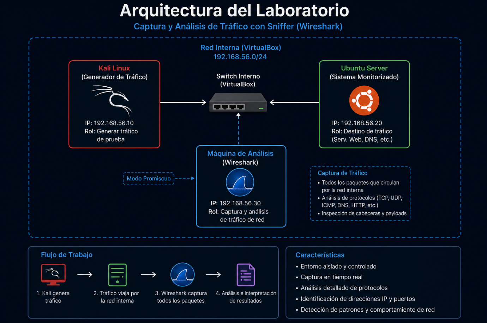
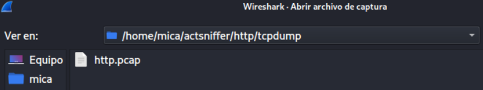
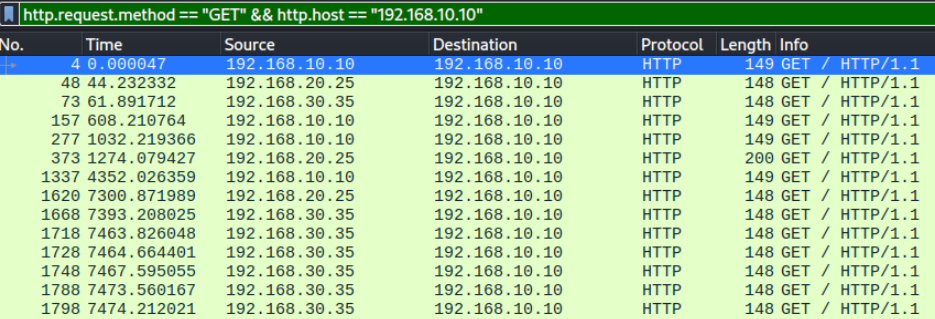
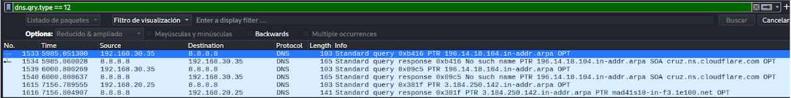
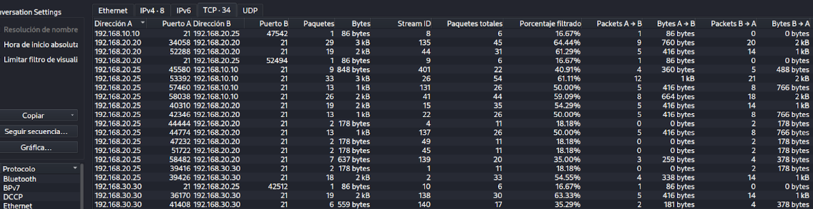
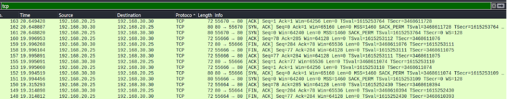

# Documentación completa - Captura y análisis de tráfico con Wireshark

# Introducción

Este laboratorio se desarrolló con el objetivo de comprender cómo funciona realmente la comunicación entre sistemas dentro de una red TCP/IP mediante captura y análisis de tráfico utilizando Wireshark.

A lo largo de las pruebas se trabajó principalmente con análisis de paquetes, inspección de protocolos y monitorización de comunicaciones entre máquinas virtuales dentro de una red interna controlada. El laboratorio permitió observar cómo circula la información entre sistemas y cómo herramientas de sniffing pueden utilizarse para inspeccionar tráfico, identificar protocolos y analizar conexiones desde una perspectiva defensiva.

Además de aprender a utilizar Wireshark, una de las partes más importantes fue interpretar correctamente la información obtenida durante las capturas, entendiendo cómo funcionan realmente protocolos como TCP, ICMP, DNS o HTTP a nivel de paquetes y comunicaciones.

El entorno utilizado estuvo completamente virtualizado utilizando VirtualBox, permitiendo generar tráfico controlado y realizar todas las pruebas dentro de un laboratorio aislado.

---

> [!NOTE]
> Todas las capturas y análisis realizados durante el laboratorio se ejecutaron únicamente sobre sistemas virtualizados y controlados con fines educativos y de aprendizaje.

---

# Objetivos del laboratorio

Los principales objetivos del proyecto fueron los siguientes:

- Capturar tráfico de red utilizando Wireshark
- Analizar protocolos TCP/IP
- Comprender el flujo de comunicación entre sistemas
- Inspeccionar paquetes y cabeceras
- Analizar tráfico HTTP, DNS e ICMP
- Identificar direcciones IP y puertos
- Utilizar filtros para aislar tráfico concreto
- Comprender técnicas básicas de monitorización de red

---

# Arquitectura del laboratorio

El entorno utilizado durante el laboratorio estuvo formado por varias máquinas virtuales conectadas mediante una red interna.

| Máquina | Función |
|---|---|
| Kali Linux | Generación de tráfico |
| Ubuntu Server | Sistema monitorizado |
| Wireshark | Captura y análisis de paquetes |

La máquina Kali Linux se utilizó para generar tráfico mediante diferentes pruebas de conectividad, consultas DNS y navegación, mientras que Wireshark permitió capturar e inspeccionar todo el tráfico circulante dentro de la red.



---

# 1. Preparación del entorno

## 1.1 Configuración inicial

Antes de comenzar las capturas fue necesario configurar correctamente las máquinas virtuales y la red interna utilizada durante el laboratorio.

Las máquinas se desplegaron dentro de VirtualBox utilizando una red interna aislada para garantizar que todo el tráfico generado permaneciera únicamente dentro del entorno de pruebas.

También se configuraron direcciones IP estáticas para facilitar la conectividad y mantener una infraestructura estable durante todas las capturas.

---

## 1.2 Identificación de interfaces de red

Antes de iniciar Wireshark fue necesario identificar correctamente las interfaces de red disponibles dentro del sistema.

Para ello se utilizó:

```bash
ip a
```

Este comando permitió visualizar:

- interfaces activas
- direcciones IP
- estado de conexión
- adaptadores de red

Identificar correctamente la interfaz resultó especialmente importante porque seleccionar un adaptador incorrecto provocaba capturas vacías o tráfico no relacionado con el laboratorio.

---

## 1.3 Instalación de Wireshark

Wireshark se instaló utilizando los repositorios oficiales del sistema:

```bash
sudo apt install wireshark -y
```

Posteriormente se verificó el funcionamiento correcto de la herramienta y el acceso a interfaces de captura.

---

# 2. Captura de tráfico de red

## 2.1 Inicio de capturas

Una vez configurado el entorno se iniciaron capturas desde la interfaz seleccionada dentro de Wireshark.

El objetivo principal fue monitorizar todas las comunicaciones generadas entre las máquinas virtuales del laboratorio y posteriormente analizar los paquetes obtenidos.

Durante las pruebas se generó tráfico controlado relacionado con:

- ICMP
- DNS
- HTTP
- TCP
- ARP



---

## 2.2 Generación de tráfico ICMP

Para generar tráfico ICMP se realizaron pruebas utilizando:

```bash
ping 192.168.56.20
```

Esto permitió visualizar paquetes relacionados con:

- Echo Request
- Echo Reply
- tiempos de respuesta
- conectividad entre sistemas

El análisis ayudó especialmente a comprender cómo funciona ICMP y cómo se utiliza dentro de tareas básicas de diagnóstico de red.

---

## 2.3 Generación de tráfico HTTP

También se realizaron pruebas relacionadas con tráfico HTTP mediante navegación y conexiones web básicas.

Durante el análisis se observaron:

- peticiones GET
- respuestas del servidor
- cabeceras HTTP
- contenido transmitido

Una de las partes más interesantes fue comprobar cómo determinadas comunicaciones HTTP pueden visualizarse en texto claro cuando no existe cifrado.



---

# 3. Análisis de protocolos

## 3.1 Análisis de TCP

TCP fue uno de los protocolos más importantes analizados durante el laboratorio.

Se observaron especialmente:

- handshake de tres vías
- flags TCP
- puertos
- secuencias
- acknowledgements
- cierre de sesiones

Wireshark permitió seguir conversaciones completas mediante streams TCP y visualizar el flujo completo de información entre sistemas.

---

## 3.2 Análisis de DNS

Durante las pruebas también se analizaron consultas DNS utilizando filtros específicos.

Para generar tráfico DNS se utilizaron herramientas como:

```bash
nslookup
```

y navegación web básica.

El análisis permitió observar:

- consultas DNS
- respuestas DNS
- dominios solicitados
- IPs devueltas
- tiempos de resolución



---

## 3.3 Análisis de ARP

Durante las capturas también apareció tráfico ARP relacionado con resolución de direcciones MAC dentro de la red local.

Aunque normalmente este protocolo pasa desapercibido, resulta fundamental para el funcionamiento correcto de comunicaciones Ethernet.

---

# 4. Uso de filtros en Wireshark

## 4.1 Importancia de los filtros

Una de las partes más importantes del laboratorio fue aprender a utilizar filtros correctamente dentro de Wireshark.

Sin filtros adecuados, la cantidad de paquetes visibles puede resultar muy difícil de analizar manualmente.

Los filtros permitieron centrarse únicamente en tráfico concreto relacionado con:

- protocolos específicos
- direcciones IP
- puertos
- conexiones determinadas

---

## 4.2 Filtros utilizados

Algunos de los filtros más utilizados durante las pruebas fueron:

```txt
icmp
```

```txt
dns
```

```txt
http
```

```txt
tcp
```

```txt
ip.addr == 192.168.56.10
```

```txt
tcp.port == 80
```


---

# 5. Inspección de paquetes

## 5.1 Análisis de cabeceras

Durante las capturas se inspeccionaron diferentes cabeceras relacionadas con:

- Ethernet
- IP
- TCP
- UDP
- DNS
- HTTP
- ICMP

Wireshark permitió visualizar cada capa de los paquetes y comprender cómo se estructura realmente la información transmitida entre sistemas.

---

## 5.2 Información observada

Entre los principales datos analizados se encontraron:

- IP origen y destino
- puertos
- protocolos utilizados
- tamaño de paquetes
- flags TCP
- payloads
- tiempos

Esto ayudó especialmente a comprender cómo circula realmente la información dentro de la red.



---

# 6. Seguimiento de conexiones TCP

## 6.1 Follow TCP Stream

Una de las funciones más útiles trabajadas durante el laboratorio fue:

```txt
Follow TCP Stream
```

Esta opción permitió reconstruir conversaciones completas entre sistemas y visualizar el intercambio de información dentro de determinadas conexiones.

Gracias a esta funcionalidad fue posible comprender mucho mejor el flujo real de las comunicaciones TCP.



---

# 7. Observaciones de seguridad

## 7.1 Tráfico visible y tráfico cifrado

Durante las pruebas se observó claramente cómo determinadas comunicaciones pueden visualizarse completamente cuando no existe cifrado.

Esto permitió comprender la importancia de protocolos seguros como HTTPS y cómo el tráfico sin cifrar puede exponer información sensible dentro de una red.

---

## 7.2 Importancia de la monitorización

El laboratorio también ayudó a comprender cómo herramientas de captura de tráfico forman parte importante de tareas relacionadas con:

- monitorización defensiva
- troubleshooting
- análisis forense
- detección de anomalías
- Blue Team

El análisis de tráfico proporciona muchísima información relacionada con el comportamiento de sistemas y comunicaciones dentro de una infraestructura.

---

> [!TIP]
> Analizar tráfico de red no solo sirve para detectar ataques. También ayuda muchísimo a entender cómo funcionan realmente las aplicaciones, protocolos y servicios dentro de una infraestructura TCP/IP.

---

# 8. Resultados obtenidos

El laboratorio permitió comprender mucho mejor cómo circula la información dentro de redes TCP/IP y cómo herramientas como Wireshark pueden utilizarse para inspeccionar tráfico de forma detallada.

Además de aprender técnicas básicas de captura y filtrado, el proyecto ayudó especialmente a reforzar conocimientos relacionados con:

- protocolos de red
- análisis de paquetes
- monitorización
- networking
- Blue Team
- tráfico TCP/IP
- Wireshark
- análisis defensivo

---

# 9. Conclusiones

Este laboratorio permitió trabajar de forma práctica conceptos fundamentales relacionados con captura y análisis de tráfico dentro de redes TCP/IP.

Además de aprender a utilizar Wireshark, la parte más importante fue comprender cómo funcionan realmente las comunicaciones entre sistemas y cómo el análisis de paquetes puede utilizarse tanto para monitorización defensiva como para troubleshooting y análisis de seguridad.

El proyecto ayudó especialmente a desarrollar una visión mucho más práctica sobre protocolos, tráfico de red y monitorización dentro de entornos Linux virtualizados.
